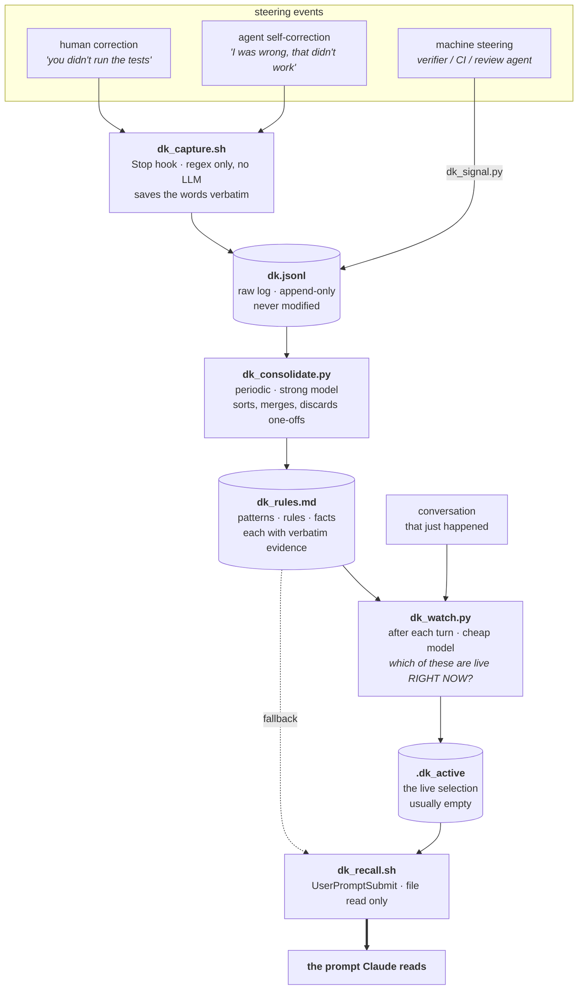
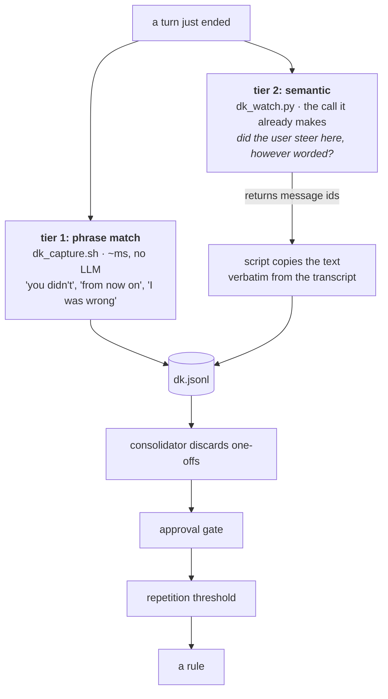
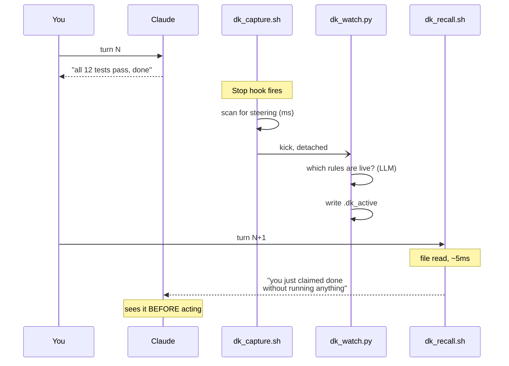
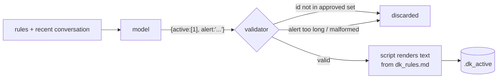
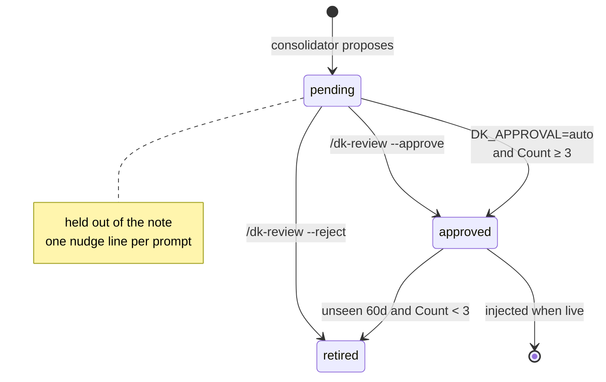

# How dk-mode works

The one-line version: **an agent cannot know it is about to repeat a mistake,
so something outside it has to notice and say so at the moment it matters.**

Everything below follows from that. Diagrams render on GitHub.

---

## The problem being solved

Standard agent memory is a retrieval tool the model calls when it thinks it
needs context. That works for facts ("what port does the dev server use") and
fails for behaviour, because the model does not know to look up *times I was
lazy* **before** being lazy — noticing the in-progress failure is the exact
capability that is failing. Hence the name: the Dunning-Kruger zone, where
confidence is highest and self-assessment is worthless.

The obvious fix — put the rules in the system prompt — trades one failure for
another. A rule present on every single turn is background noise by turn 40;
attention dilutes, and the longer the conversation the weaker it gets.

So dk-mode does two things instead: it **mines** steering from what actually
happened, and it **injects only what is live right now**, forced into the
prompt rather than left to the model's judgment.

---

## The whole loop



The heavy arrow is the whole point: injection is **forced**. The model does
not choose to look — the text is simply there.

---

## How issues actually get noticed (and why regex alone fails)

Capture runs in two tiers, because a phrase list and a reading model fail in
opposite directions.



**Measured, not assumed.** Running tier 1 over a real 46-message working
session: it caught **zero** of the user's actual corrections. The only things
it matched were trigger words quoted inside subagent notifications — noise
attributed to the user, now filtered. Running tier 2's prompt over the same
session: **14 steering moments across 25 substantive turns**, including
every one tier 1 missed.

The reason is simple once you look at real corrections. People do not
announce them:

> "Mock api is a shit way to test, it needs to be thorough."
> "Are we calling it remember? Bit lame."
> "that's the purpose of the whole thing, not just appending every rule"
> "ideally it will work on its own chats, I don't want it dependent on human input"
> "Simplify"

None contain a canonical correction phrase. People steer by **redirecting**.

**So why keep tier 1 at all?** It costs nothing, needs no model, and works
where tier 2 cannot run (no key, no local server, mid-backfill). It is the
floor, not the mechanism.

**Tuned for recall, deliberately.** A false positive is cheap — three
downstream filters remove it, and auto-approval needs repetition before
anything steers behaviour. A missed correction is invisible forever. So both
tiers err toward catching too much.

**Context travels with the correction.** "you didn't run the tests" is
useless six weeks later without what it was answering, so each captured
entry carries the exchange that led up to it. The consolidator cannot tell a
real failure mode from a passing remark otherwise.

**Tier 2 still cannot invent.** The model returns message **ids**; the script
copies the text out of the transcript. It reports *where* the steering was,
never *what was said*.

Known limits: slash-command invocations (`/bro` = "say that again without
jargon") are real steering, but the message body is the skill's text rather
than the user's, so they are excluded rather than misattributed. And the
14/25 figure is one model's judgment on one session, not verified ground
truth — treat it as the right order of magnitude, not a precision score.

---

## Why the relevance layer runs one turn behind

An LLM call inside `UserPromptSubmit` would stall **every message you send**
by seconds. So the selection happens on the Stop hook — after a turn ends,
where nobody is waiting — and the next prompt reads the result instantly.



A conversation's situation persists across turns, so one turn of lag costs
almost nothing. Latency on every single message would cost everything.

---

## The model selects; the script writes

The relevance layer is handed a numbered list of rules and returns **ids
only**. The rendering is done by the script from `dk_rules.md`.

Each injected item is rendered as a short episode - what it looks like, what
to do, and the words that earned it - not a bare imperative. That is
affordable precisely because injection is now selective: when the note went
out on every prompt it had to be tiny or it became wallpaper; when it goes
out only for what is live, the few items that appear can carry their
evidence.



Consequences: the model **cannot invent a rule** that isn't in your file, it
cannot reword one, and in approval mode it cannot surface anything a human
hasn't approved. Same discipline in consolidation — the rewritten file is
structurally validated before it replaces anything, and a malformed rewrite
fails loudly with the old file intact.

---

## Approval: pending items steer nothing

New items land as `pending`. A pending item is held out of the injected note
by a deterministic check (not just a prompt instruction), so an unreviewed
guess can never change behaviour.



`DK_APPROVAL=auto` is what lets the loop run unattended: **repetition is the
evidence** a human would otherwise supply. One incident may be noise; the
same failure three times across sessions has proven itself. Below the
threshold it stays pending, so a one-off never quietly becomes a rule.

---

## Every stage degrades instead of breaking

Nothing here is allowed to block a turn or lose data.

| If this is missing / broken | What happens |
|---|---|
| No API key, no local server | Capture + recall still work; consolidation and relevance quietly skip |
| Relevance layer off, unrun, or stale (>1h) | Recall falls back to the static top-5 note — never worse than always-on rules |
| Model returns garbage | Rejected by the validator, previous file kept, run marked FAILED |
| 3 consecutive failures | Every prompt says so — a notification nobody reads is not an alarm |
| Capture silently dies | 21-day tripwire announces it in-context |
| Two sessions at once | `mkdir` locks; a loser skips rather than waits |
| Bad consolidation | `dk.jsonl` was never modified — reset `consolidated_through`, re-run |

The raw log being append-only is the backbone: every distilled rule is
re-derivable from it, on a different model or backend if you want.

---

## Where the work happens

| Stage | Cost per turn | Blocking? |
|---|---|---|
| Capture | a `grep`; ~ms, and nothing at all when no signal | no (Stop hook) |
| Relevance | one small LLM call | no (detached, after the turn) |
| Recall | one file read | yes, but ~5ms |
| Consolidation | one strong LLM call, on an interval | no (detached) |

Consolidation is judgment-heavy so it gets the strong model; relevance is a
fast classification so it gets a cheap one; capture gets no model at all
because the steering text is ground truth and the model summarising its own
mistake is the least reliable narrator available. Both LLM stages run against
a local model if you point `DK_BACKEND=openai` at one.

---

## Feeding it from your own tooling

Anything that already tells an agent it got something wrong — a verifier, a
ship gate, a failing test handler, a review subagent — is a steering event
and can report itself:

```bash
dk_signal.py --kind verdict --source my-verifier \
  --text "FIX: heading promises a calculator the page does not contain" \
  --context "shipped /heating-costs"
```

Those entries flow through the same consolidation as human corrections, so a
gate's repeated complaint becomes a standing rule exactly like yours does.
The consolidator weights sources: a human's correction is the strongest
evidence, self-correction is real but weaker, and ordinary iteration (a test
failing then being fixed) is explicitly *not* a pattern.
